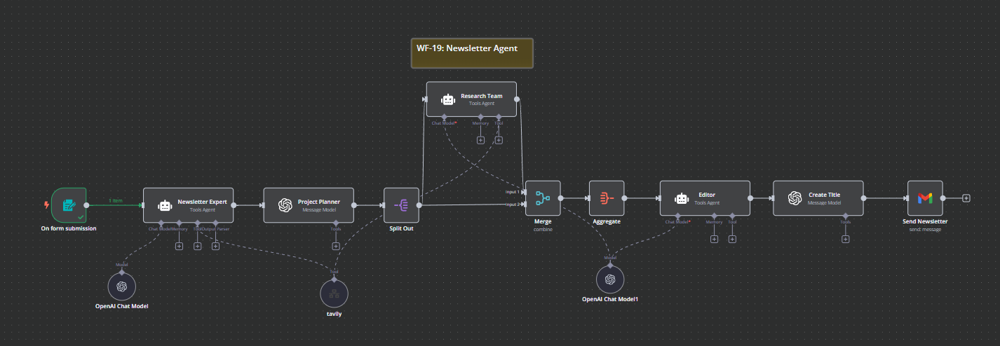
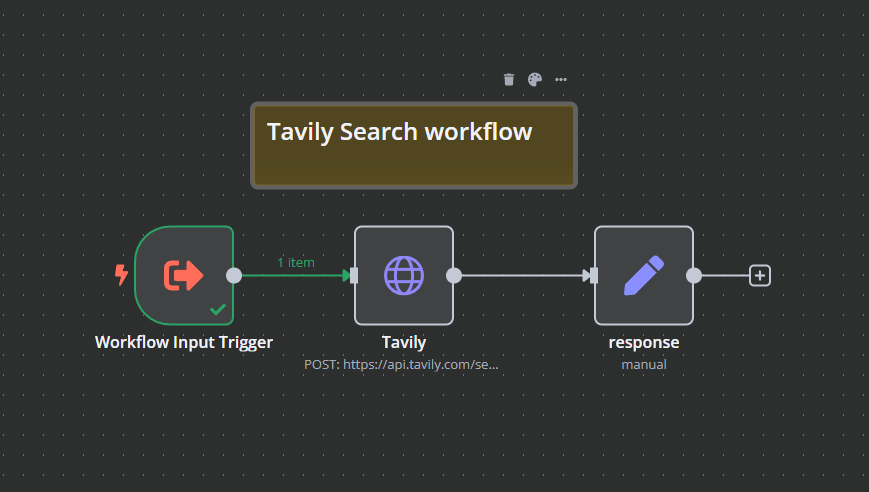

# WF-19: Newsletter Agent – n8n Workflow

## 📌 Overview
This **n8n workflow**, `WF-19: Newsletter Agent`, automates the **newsletter creation and distribution process** by gathering content from various sources, compiling it into a newsletter format, and sending it to a predefined mailing list. The workflow ensures timely and consistent communication with your audience.

## 🔧 Workflow Components
### 🏗️ Core Modules
1. **📰 Content Fetcher** – Aggregates content from RSS feeds, websites, and other sources.
2. **🖇️ Content Curator** – Filters and selects relevant articles and updates.
3. **📝 Content Formatter** – Compiles the selected content into a newsletter template.
4. **📧 Email Sender** – Sends the formatted newsletter to the mailing list.
5. **📊 Analytics Tracker** – Logs email open rates and click-through rates for performance analysis.

## ⚙️ How It Works
1. 📰 **Content Fetcher** gathers the latest articles and updates from predefined sources.
2. 🖇️ **Content Curator** filters the fetched content based on relevance and importance.
3. 📝 **Content Formatter** compiles the curated content into a newsletter format.
4. 📧 **Email Sender** distributes the newsletter to the mailing list.
5. 📊 **Analytics Tracker** monitors the performance of the sent newsletters by tracking open rates and click-through rates.

## 📷 Workflow Screenshot

## 🚀 Setup Instructions
- 📥 **Import the workflow** into `n8n`.
- 🔑 **Ensure API credentials** for content sources and email service providers are configured.
- ✅ **Activate the workflow** to start automating your newsletter process.

## 📝 Notes
- ⚠️ The workflow is **inactive by default**.
- 🛠️ Customize content sources and email templates to suit your specific needs.
- 💡 Can be extended with **additional content sources** and **advanced analytics**.

---

*This README was generated with the help of GitHub Copilot.*
